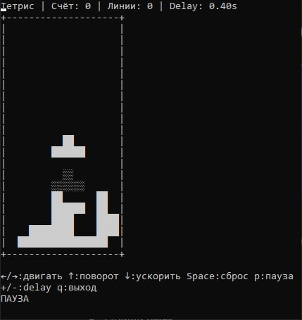

# Тетрис в терминале

Пакет:
```bash
py -3 -m pip install windows-curses
```

## Запуск

### Linux / macOS
```bash
curl -fsSL https://raw.githubusercontent.com/mr1xyyy/tetris-test/main/install.sh | bash
```

### Windows (CMD)
```cmd
curl -LO https://raw.githubusercontent.com/mr1xyyy/tetris-test/main/run_tetris.bat && run_tetris.bat
```

### Windows (вручную)
Скачайте `run_tetris.bat` и дважды кликните по нему.


## Параметры
- `--delay` — стартовая задержка падения фигур в секундах.

## Управление
- `←` / `→` — движение влево / вправо
- `↑` — поворот фигуры
- `↓` — ускоренное падение на 1 клетку
- `Space` — мгновенный сброс фигуры вниз
- `p` — пауза
- `+` / `-` — изменить задержку во время игры
- `q` — выход

## Скриншот


